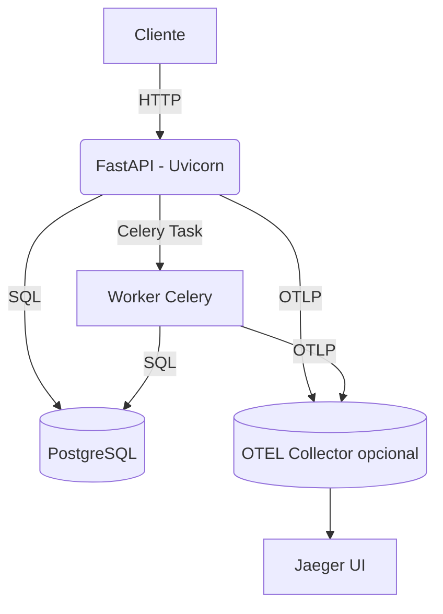

# Application Performance Monitoring (APM) con OpenTelemetry + Jaeger

Este documento explica cómo instrumentar ChessPlayerAnalyzer usando el estándar **OpenTelemetry (OTEL)** y el backend de trazas **Jaeger**. Con esta combinación obtendrás:

- Trazas distribuidas end-to-end (FastAPI ↔ Celery ↔ SQLAlchemy)
- Métricas de latencia por span/endpoint
- Integración nativa con Prometheus/Grafana
- 100 % open-source, sin obligaciones de pago

---
## 1. Arquitectura



1. FastAPI y Celery generan spans vía OTEL-SDK
2. Los spans se exportan por OTLP/Thrift al **Jaeger Agent** (o Collector)
3. Jaeger almacena y muestra las trazas en su UI

---
## 2. Dependencias

Ya añadidas en `backend/requirements.txt`:

```text
opentelemetry-sdk~=1.29.0
opentelemetry-exporter-jaeger~=1.29.0
opentelemetry-instrumentation-fastapi~=0.51b0
opentelemetry-instrumentation-celery~=0.51b0
opentelemetry-instrumentation-sqlalchemy~=0.51b0
```

Instala (o reconstruye tu imagen Docker):

```bash
pip install -r backend/requirements.txt
```

---
## 3. Variables de entorno OTEL

```bash
# Nombre del servicio que aparecerá en Jaeger
OTEL_SERVICE_NAME=chess-analyzer

# Host/puerto donde corre Jaeger Agent (por defecto docker-compose levanta jaeger:6831)
OTEL_EXPORTER_JAEGER_AGENT_HOST=jaeger
OTEL_EXPORTER_JAEGER_AGENT_PORT=6831
```

Opcionales:

```bash
OTEL_EXPORTER_OTLP_ENDPOINT=http://otel-collector:4318  # Si usas OTEL Collector
OTEL_TRACES_SAMPLER=parentbased_always_on               # always_on | always_off | parentbased_...
```

---
## 4. Despliegue de Jaeger

### Docker Compose mínimo

```yaml
version: "3.8"
services:
  jaeger:
    image: jaegertracing/all-in-one:1.57
    ports:
      - "16686:16686"  # UI
      - "6831:6831/udp"  # Thrift over UDP
```

Accede luego a `http://localhost:16686` para ver las trazas.

---
## 5. Instrumentación aplicada en el código

| Componente | Instrumentación | Archivo |
|------------|-----------------|---------|
| FastAPI    | `FastAPIInstrumentor.instrument_app(app)` | `app/otel.py` |
| Celery     | `CeleryInstrumentor().instrument()` | `app/otel.py` |
| SQLAlchemy | `SQLAlchemyInstrumentor().instrument(engine=engine)` | `app/otel.py` |

Además `init_otel()` se llama:
- En `app/main.py` (pasa el objeto `app` de FastAPI para instrumentar rutas)  
- En `app/celery_app.py` (sin parámetros) para instrumentar workers

---
## 6. Ejemplo de traza

Una llamada a `POST /api/v1/players/{username}` producirá un árbol similar:

```
► POST /api/v1/players/hikaru          120 ms
   ├─ SQL SELECT player ...              4 ms
   ├─ Redis GET lock                     1 ms
   ├─ Celery publish task               15 ms
   └─ HTTP 202                           —
```

Haz clic en cada span dentro de Jaeger UI para ver atributos (headers, parámetros, etc.).

---
## 7. Métricas en Prometheus

Además de trazas, OTEL-SDK puede exportar métricas; aquí usamos ya `prometheus_fastapi_instrumentator` para HTTP. Si deseas métricas OTEL nativas, despliega un OTEL Collector con pipeline Prometheus.

---
## 8. Buenas prácticas de sampling

| Entorno      | OTEL_TRACES_SAMPLER | Comentario |
|--------------|--------------------|------------|
| Desarrollo   | `always_on`        | Capturar todo para depuración |
| Staging      | `parentbased_traceidratio` (0.5) | 50 % de muestreo |
| Producción   | `parentbased_traceidratio` (0.1) | Reducir volumen |

Controla la fracción con `OTEL_TRACES_SAMPLER_ARG=0.1`.

---
## 9. Eliminación de Sentry

Los módulos y variables de Sentry han sido retirados; asegura borrar `SENTRY_*` del `.env`.

---
## 10. Preguntas frecuentes

**No veo trazas en Jaeger**
1. Verifica conexión (`nc -z jaeger 6831`).
2. Aumenta el nivel de sampler (`always_on`).
3. Comprueba logs de OTEL Collector o del servicio.

**¿Cómo capturo excepciones personalizadas?**
OTEL captura automáticamente errores no gestionados. Para añadir atributos:

```python
from opentelemetry import trace

otel_span = trace.get_current_span()
otel_span.record_exception(e)
otel_span.set_attribute("custom.key", "value")
```

Listo — ¡tus trazas ahora son open-source ✨! 