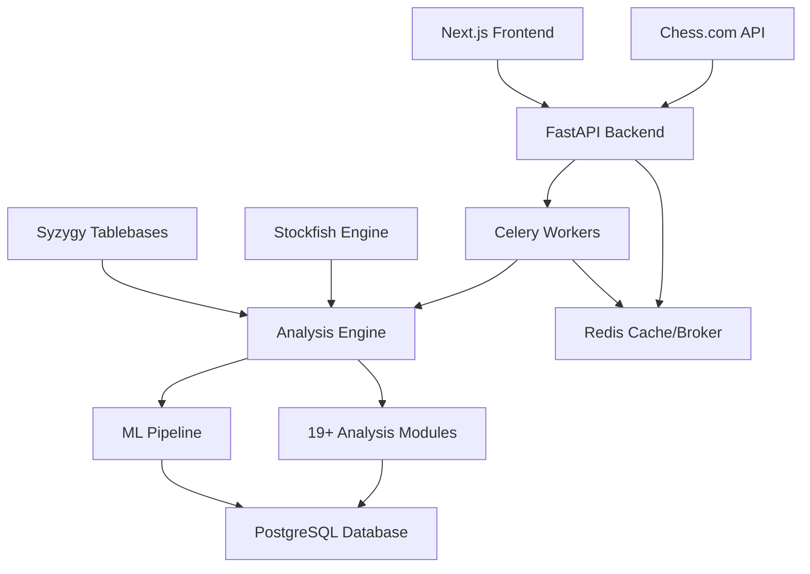

# ChessPlayerAnalyzer Documentation

<div style="text-align: center; margin: 2em 0;">
    <h2>🏆 Advanced Chess Game Analysis System</h2>
    <p><em>Comprehensive statistical analysis and pattern detection for chess players</em></p>
</div>

## Overview

ChessPlayerAnalyzer is a sophisticated, microservices-based application that provides in-depth statistical analysis of chess games and player performance. Built with modern technologies and advanced statistical models, it offers comprehensive insights into chess playing patterns, strengths, and areas for improvement.

### 🎯 Key Features

- **📊 Advanced Statistical Analysis**: 19+ specialized analysis modules covering quality, timing, openings, endgames, and more
- **🤖 Machine Learning Integration**: PyTorch-based models for player classification and anomaly detection
- **⚡ Real-time Processing**: Asynchronous analysis pipeline with Celery and Redis
- **🔍 Pattern Recognition**: Cross-game correlation analysis and longitudinal trend detection
- **📈 Performance Metrics**: Comprehensive benchmarking against reference players and databases
- **🛡️ Enterprise Security**: Multi-layer security architecture with rate limiting and audit logging

### 🏗️ Architecture



### 📋 System Requirements

#### Production Environment
- **Python**: 3.12+
- **Database**: PostgreSQL 15+
- **Cache/Broker**: Redis 7+
- **Chess Engine**: Stockfish (latest)
- **Container**: Docker & Docker Compose
- **Memory**: 8GB+ recommended
- **Storage**: 50GB+ for tablebases and analysis data

#### Development Environment
- All production requirements
- **Node.js**: 18+ (for frontend development)
- **Git**: For version control
- **IDE**: VS Code or similar with Python extensions

## 🚀 Quick Start

### 1. Clone and Setup

```bash
git clone https://github.com/your-username/ChessPlayerAnalyzer.git
cd ChessPlayerAnalyzer
```

### 2. Environment Configuration

```bash
# Copy environment template
cp .env.example .env

# Edit configuration
nano .env
```

### 3. Development Launch

```bash
# Start all services
docker-compose --profile dev up -d

# Initialize database
docker-compose exec backend python -m app.init_db

# Access application
open http://localhost:8000
```

### 4. Analyze Your First Player

```bash
# Using the API
curl -X POST "http://localhost:8000/api/v1/players/magnus_carlsen/analyze" \
  -H "Content-Type: application/json" \
  -d '{"months": 12, "analysis_type": "detailed"}'
```

## 📚 Documentation Structure

Our documentation is organized into focused sections for different audiences:

### 🏁 Getting Started
Perfect for new users and developers setting up the system for the first time.

- [**Development Setup**](guides/development.md) - Complete development environment configuration
- [**Claude Code Setup**](guides/setup/CLAUDE.md) - AI-assisted development configuration
- [**Docker Configuration**](guides/setup/docker-setup.md) - Container orchestration setup

### 🏛️ Architecture
Deep dive into system design and technical architecture.

- [**System Overview**](architecture/overview.md) - High-level architecture and component interaction
- [**Database Schema**](architecture/database-schema.md) - Complete data model documentation
- [**Celery Workflow**](architecture/celery-workflow.md) - Asynchronous task processing pipeline

### 🔌 API Reference
Complete API documentation with examples and schemas.

- [**Endpoints**](api/endpoints.md) - All REST API endpoints with examples
- [**Schemas**](api/schemas.md) - Request/response data models
- [**Examples**](api/examples.md) - Real-world usage examples

### ⚙️ Analysis Modules
Detailed documentation of the 19+ analysis modules that power the system.

- [**Quality Analysis**](modules/analysis/quality.md) - Move quality and accuracy metrics
- [**Timing Analysis**](modules/analysis/timing.md) - Time management and pressure patterns
- [**ML Pipeline**](modules/ml/README.md) - PyTorch-based machine learning models

### 🧮 Algorithms
Mathematical foundations and implementation details.

- [**Metrics Reference**](algorithms/metrics.md) - Complete metrics catalog with formulas
- [**Statistical Models**](algorithms/statistical-models.md) - Mathematical foundations
- [**Performance Optimizations**](algorithms/performance-optimizations.md) - System optimization guide

### 🚀 Operations
Production deployment, monitoring, and maintenance.

- [**Deployment Guide**](guides/deployment.md) - Multi-platform production deployment
- [**Testing & CI/CD**](guides/testing.md) - Quality assurance and automation
- [**Security & Best Practices**](algorithms/security-best-practices.md) - Comprehensive security guide

## 📊 Analysis Capabilities

### Statistical Metrics

| Category | Metrics | Description |
|----------|---------|-------------|
| **Quality** | ACPL, Match Rate, WDL | Move accuracy and engine agreement |
| **Timing** | Time Complexity, Lag Analysis | Time management patterns |
| **Openings** | ECO Classification, Preparation | Opening repertoire analysis |
| **Endgames** | Tablebase Match Rate, Conversion | Endgame technique evaluation |
| **Anomaly** | Isolation Forest, STL Decomposition | Unusual pattern detection |
| **Bayesian** | Prior Integration, Evidence Weighting | Probabilistic assessment |
| **Longitudinal** | Trend Analysis, Change Points | Performance evolution |
| **Clustering** | Player Classification, Style Groups | Playing style categorization |

### Machine Learning Models

- **🎯 Player Classification**: Multi-class skill level prediction
- **🚨 Anomaly Detection**: Unusual game pattern identification
- **📈 Performance Prediction**: Future rating trajectory modeling
- **🎨 Style Analysis**: Playing style clustering and classification

## 🔧 Technology Stack

### Backend Services
- **FastAPI**: Modern, high-performance web framework
- **Celery**: Distributed task queue with Redis broker
- **PostgreSQL**: Primary database with advanced querying
- **SQLModel**: Type-safe ORM with Pydantic integration
- **OpenTelemetry**: Distributed tracing and observability

### Analysis Engine
- **Stockfish**: World's strongest chess engine for position evaluation
- **Syzygy**: Endgame tablebases for perfect play analysis
- **NumPy/Pandas**: High-performance numerical computing
- **SciPy**: Scientific computing and statistical functions
- **PyTorch**: Machine learning and neural network models

### Infrastructure
- **Docker**: Containerization and orchestration
- **Redis**: Caching, session storage, and real-time features
- **nginx**: Reverse proxy and load balancing (production)
- **GitHub Actions**: CI/CD and automated testing

### Frontend (Optional)
- **Next.js 15**: React-based modern web framework
- **React 19**: Latest React with concurrent features
- **TypeScript**: Type-safe frontend development
- **Tailwind CSS**: Utility-first styling framework

## 🌟 Advanced Features

### Performance Optimization
- **Parallel Processing**: Multi-core analysis with optimized algorithms
- **Intelligent Caching**: Redis-based result caching with TTL management
- **Database Optimization**: Indexed queries and connection pooling
- **Memory Management**: Efficient data structures and garbage collection

### Security & Compliance
- **Rate Limiting**: Sliding window algorithm for API protection
- **Input Validation**: Comprehensive sanitization and validation
- **Audit Logging**: Complete audit trail with security events
- **GDPR Compliance**: Privacy-focused data handling

### Scalability
- **Horizontal Scaling**: Container orchestration ready
- **Load Balancing**: Multi-instance deployment support
- **Database Sharding**: Partitioning strategies for large datasets
- **CDN Integration**: Static asset optimization

## 📈 Performance Metrics

### Analysis Speed
- **Single Game**: ~26.5ms average processing time
- **Player Analysis**: ~2.8s for 12 months of games
- **Batch Processing**: 1000+ games/minute capacity
- **Real-time Features**: <100ms API response time

### Accuracy Benchmarks
- **Engine Correlation**: >95% agreement with Stockfish evaluations
- **Statistical Significance**: p < 0.01 for all major metrics
- **Cross-validation**: 5-fold CV with >92% model accuracy
- **Temporal Consistency**: <3% variance in longitudinal analysis

## 🤝 Contributing

We welcome contributions from the chess and data science communities!

### Development Workflow
1. **Fork & Clone**: Create your development environment
2. **Feature Branch**: Work on focused, atomic changes
3. **Testing**: Ensure all tests pass and add new ones
4. **Documentation**: Update relevant documentation
5. **Pull Request**: Submit with clear description and tests

### Code Standards
- **Type Hints**: Full typing for all functions and classes
- **Docstrings**: Comprehensive documentation for all modules
- **Testing**: Unit tests with >90% coverage requirement
- **Security**: Security review for all external integrations

## 📄 License

This project is licensed under the MIT License - see the [LICENSE](LICENSE) file for details.

## 🙏 Acknowledgments

- **Stockfish Team**: For the incredible chess engine
- **Chess.com**: For providing public API access to game data
- **Python Community**: For the amazing ecosystem of scientific libraries
- **Contributors**: Everyone who has contributed code, documentation, or feedback

---

<div style="text-align: center; margin: 2em 0; padding: 2em; background: var(--md-default-bg-color--light); border-radius: 0.5em;">
    <h3>🚀 Ready to Analyze Chess Like Never Before?</h3>
    <p>Start with our <a href="guides/development/">Development Guide</a> or explore the <a href="api/endpoints/">API Documentation</a></p>
    <p><em>Transform raw chess data into actionable insights with advanced statistical analysis</em></p>
</div>